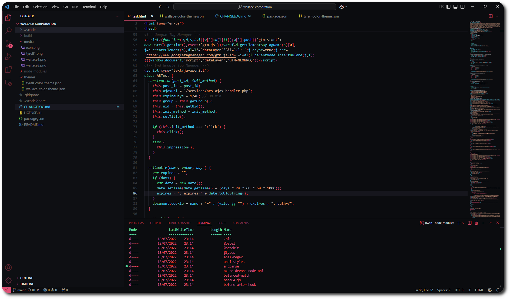

# Wallace Corporation Colour Themes

Blade Runner inspired colour themes for VSCode and VSCodium. The extension can be found on [VS Marketplace](https://marketplace.visualstudio.com/items?itemName=hc.wallace-corporation) and [Open VSX Registry](https://open-vsx.org/extension/hc/wallace-corporation).

*The 'Wallace Corporation' theme is more or less in its finalised state. There are currently some readabiliy issues that I need to sort out for the monochromatic themes (e.g. search highlighting in command palette is unreadable).*

## Wallace Corporation

## Tyrell Corporation

[</a>](https://raw.githubusercontent.com/h-cwc/wallace-corporation/main/media/tyrell1.png)